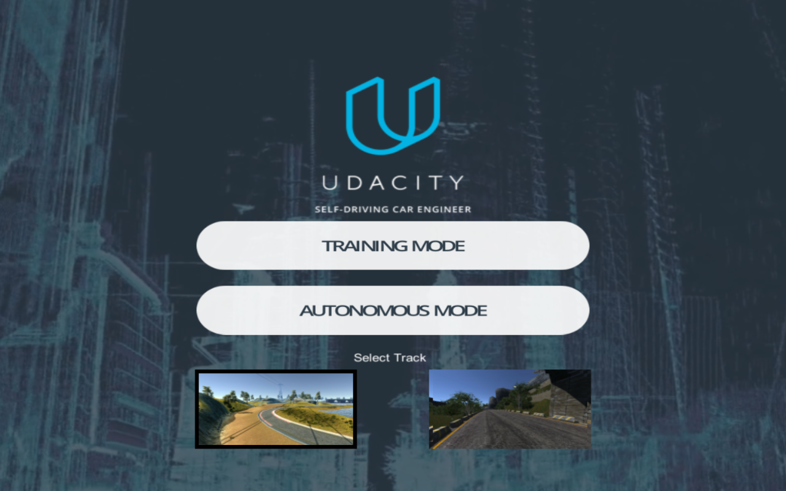
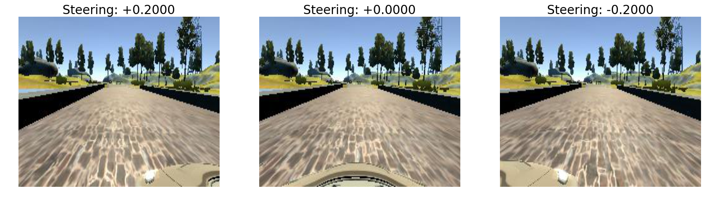
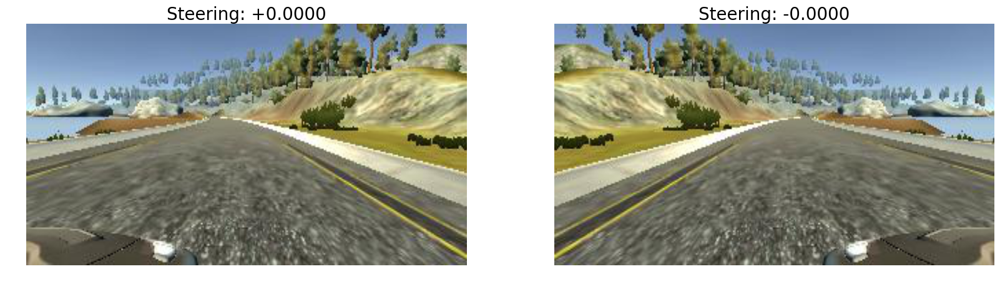
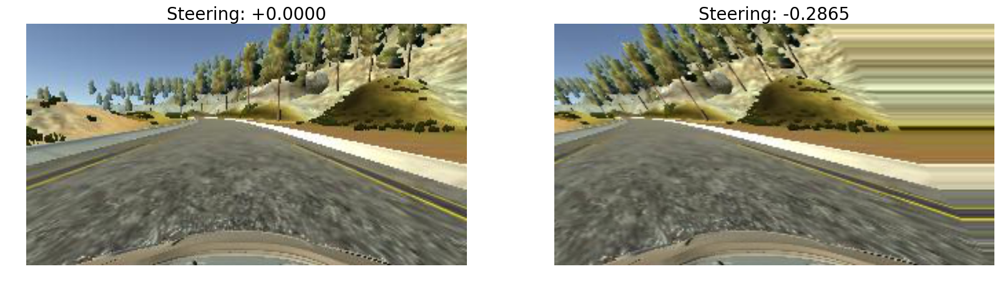
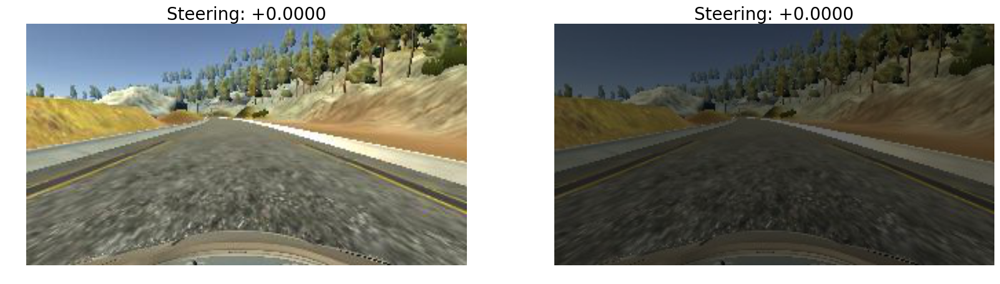
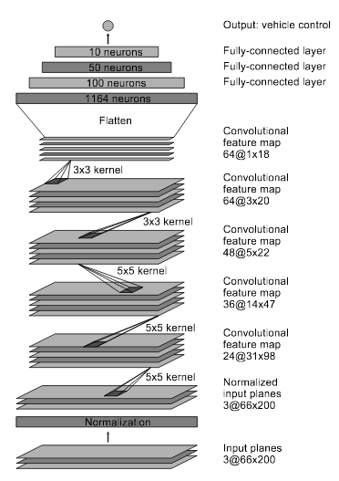
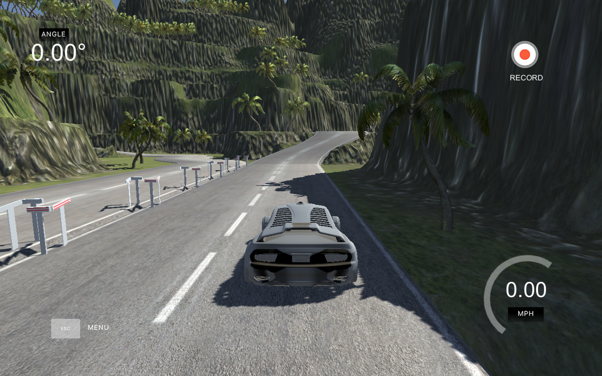

#**Behavioral Cloning**

---

**Behavioral Cloning Project**

##Introduction:

The objective of this project is to clone human driving behavior using a Deep Neural Network.  In order to achieve this, we are going to use a simple Car Simulator. During the training phase, we control our car using the keyboard. During controlling the car, the simulator records training images and respective steering angles. Then we use those recorded data to train our model.

The goals / steps of this project are the following:
* Use the simulator to collect data of good driving behavior
* Build, a convolution neural network in Keras that predicts steering angles from images
* Train and validate the model with a training and validation set
* Test that the model successfully drives around track one without leaving the road
* Summarize the results with a written report

## 1. Data Recording

The simulator has Training mode and Autonomous mode and two courses. Training mode is used to collect training data by driving through the tracks and recording the driving data. The Autonomous mode is the test mode for our trained model.

We could get the training data from training mode, but I couldn't get a good dataset by using laptop keyboard. Therefore I decided to use the dataset provided by Udacity. Udacity dataset has the number of 24,108 data as below:

- number of images taken from a center camera: 8036
- number of images taken from a camera translated to the left: 8036
- number of images taken from a camera translated to the right: 8036
- color channels: 3 (RGB)
- dimensions: 320x160

Attributes available in the dataset:

- 'center' - center camera image
- 'left' - left camera image
- 'right' - right camera image
- 'steering' - steering angle at the time the images was taken
- 'throttle' - throttle value
- 'brake' - brake value
- 'speed' - speed value

Bellow is an example of the left, center and right images.

## 2. Data Augmentation

I referenced the Kaspar blog on Medium and Keras blog for this section.

[Kaspar Sakmann's post](https://medium.com/@ksakmann/behavioral-cloning-make-a-car-drive-like-yourself-dc6021152713#.wlt8apczg)

[Keras Blog](https://blog.keras.io/building-powerful-image-classification-models-using-very-little-data.html)

The following are augmentation steps for my project.

- Random flipping

Almost of course 1 curves are left.
Therefore, in order to balance left and right curves, I flipped the images and choose
the flipping probability 50%.

- Random shear

- Random brightness

Changing brightness to simulate day, night and rainy day conditions.

- Compose

The image bellow shows an example of a composed image

First layer is the normalization layer. According to the Nvidia paper, this enables normalization also to be accelerated via GPU processing.

Convolution were used in the first three layers with 2x2 strides and a 5x5 kernel and non-stride convolution with 3x3 kernel size in the last two convolutional layers.

The convolutional layers were followed by three fully connected layers which then outputs the steering angle.

Activation to introduce non-linearities into the model: I chose ELU as my activation.

I used the Dropout (0.5) and L2 Regularization (0.001) on all layer to avoiding the overfitting. This turned out to be a good practice as the model could generalize to the second track, without using it for training.

I used Adam optimizer and learning rate 0.001. I tried to train my model using some learning rate such as 0.01 and 0.005. Finally, I got the best results using learning rate 0.001, so I choose the 0.001 for my model training.

Finally, I got the my trained model: model_course1.h5

## 4. Model Testing

The trained model was tested on the first track. This gave a good result, as the car could drive on the track smoothly. (See run1.mp4)

Additionally, to test for generalization, the model was tested on the second track. It is good to note that the model never trained on samples from this track, yet it drives successfully on it. (See run2.mp4)

## 5. Conclusion

A deep learning model to drive autonomously on a simulated track was trained by using a human behaviour-sampled data. The model, which includes 5 layers of convolution and 3 more fully connected layers, was able to learn by cloning human behaviour, and was able to generalize response to a new test track. Though the model only controls the steering angle, it can also be extended to control throttle and brake.

## 6. Next steps

I test my model on Udacity new course, but my model couldn't complete driving the course. Therefore, I need to generalize my model and change the augmentation strategy.

